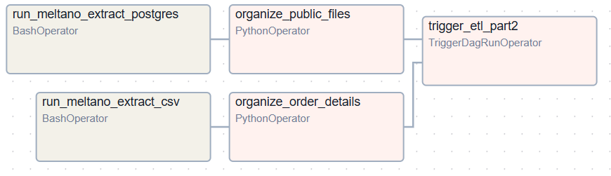
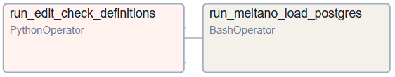
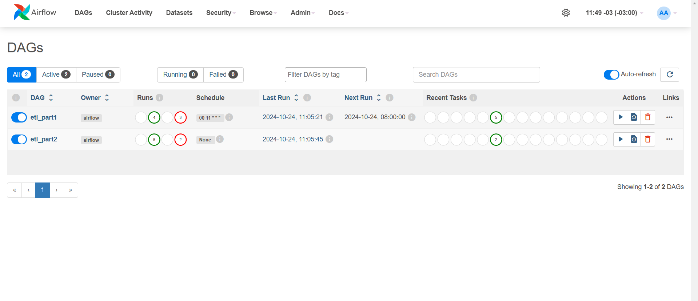

# Indicium Tech Code Challenge

## Introdução

Este projeto de Engenharia de Dados baseado no desafio da vaga de estágio da Indicium, utiliza uma arquitetura baseada em contêineres para implementar um pipeline de dados robusto e escalável. Ele integra diversas tecnologias, incluindo Apache Airflow, PostgreSQL, Python e Meltano, permitindo a extração, transformação e carga (ETL) eficiente de dados.

Para uma descrição detalhada do projeto [clique aqui](https://github.com/techindicium/code-challenge).

## Tecnologias e Linguagens Utilizadas

Este projeto utiliza uma variedade de linguagens e tecnologias para garantir um fluxo de trabalho eficiente e escalável. Abaixo estão listadas as principais tecnologias utilizadas:

### 1.  **Python**
### 2.  **SQL**
### 3.  **Apache Airflow**
### 4.  **PostgreSQL**
### 5.  **Docker**
### 6.  **Meltano**

## Proposta de solução
A solução é divida em três etapas:

**Primeira etapa**, foi realizada a configuração do `Dockerfile` e `docker-compose.yml` para a criação das imagens do Airflow e de todas as suas dependências. Também foram criados o banco PostgreSQL inicial (`db-initial`) e o banco PostgreSQL final (`db-final`), além da instalação de todas as ferramentas necessárias.

### **Segunda etapa**
Criação das DAGs e funções utilitárias (`dags/src`) usadas para a execução do projeto.

- **src**
  - `check_directory.py`: Verifica se existe uma pasta com o nome da data no diretório.
  - `edit_definitions.py`: Edita as datas no `files-definitions-part2.py`, usadas pelo Meltano para extrair os dados.
  - `organize_order_details.py`: Organiza o arquivo `order-details` na pasta `csv`, de acordo com a data.
    - Exemplo:
      ```bash
      csv/
      └── 2024-10-04/
          └── order-details.csv
      ```
  - `organize_public_files.py`: Organiza os arquivos `public-files` na pasta `postgres`, de acordo com a tabela e a data.
    - Exemplo:
      ```bash
      postgres/
      ├── categories/
      │   └── 2024-10-04/
      │       └── public-categories.csv
      ├── customers/
      │   └── 2024-10-04/
      │       └── public-customers.csv
      ```

- **dags**
  - `etl_part1.py`: Executa a extração, carregamento e organização dos dados:
    - **Fonte:** PostgreSQL (`db-initial`) → **Destino:** Local (`postgres`) --- Organiza os arquivos `public-files.csv`
    - **Fonte:** Local (`initial/order_details.csv`) → **Destino:** Local (`csv`) --- Organiza os arquivos `order-details.csv`
    - Executa o script `etl_part2.py`
  
    

  - `etl_part2.py`: Executa a extração, carregamento e organização dos dados, baseado no tipo de execução. Se for manual, solicita a inserção da data; caso contrário, considera o dia atual.
    - Edita o arquivo `files-definitions-part2.py`, usado pelo Meltano de acordo com a data.
    - **Fonte:** Local (`csv / postgres`) → **Destino:** PostgreSQL (`db-final`)
  
    

## Passos para a instalação 

Siga os passos abaixo para instalar e executar o projeto.

### Pré-requisitos

- Certifique-se de ter o [Docker](https://docs.docker.com/get-docker/) instalado na sua máquina.
- Git instalado (caso ainda não tenha, siga [este guia](https://git-scm.com/book/en/v2/Getting-Started-Installing-Git)).

### 1. Clone o repositório do GitHub

Abra o terminal e execute o comando abaixo para clonar o repositório:

```bash
git clone https://github.com/RafaelViniciusBrambillaAlves/code-challenge
```
### 2. Acesse o diretório do projeto

Entre no diretório do projeto clonado:

```bash
cd code-challenge
```
### 3. Configure o ambiente com Docker

No diretório do projeto, execute o seguinte comando para inicializar o ambiente usando Docker:

```
docker compose up -d
```

Isso irá baixar as imagens necessárias e iniciar os containers em segundo plano.

### 4. Acesse o Airflow 

Abra seu navegador e acesse o Airflow pela URL:

```bash
http://localhost:8080
```

Para o login:
Usuário: airflow
Senha: airflow

## Execução 

As DAGs `etl_part1` e `etl_part2` não dependem uma da outra. 

A DAG `etl_part2` não é executada automaticamente se a DAG `etl_part1` falhar. 

É possível executar a DAG `etl_part2` manualmente, com qualquer data anterior. 

A DAG está configurada para execução diária às 11:00.



Para testar de maneira automática todo o fluxo das DAGs, na DAG `etl_part1`, clique em **Trigger DAG** e, para visualizar, entre e veja os gráficos. 

Para testar a DAG `etl_part2` de maneira manual, clique em **Trigger DAG** e insira a data no formato válido (YYYY-MM-DD).

### Final 

Para ver o resultado final, entre no container do banco final utilizando o seguinte comando:

```bash
docker exec -it code-challenge-db-final-1 bash
```

Em seguida, execute a query que está na pasta query/query.sql, que mostra seus pedidos e detalhes. O arquivo .csv com o resultado pode ser encontrado na pasta query/result/result.csv.


## Desafios e Opiniões sobre o desafio

O desafio foi bem legal e me permitiu aplicar conhecimentos em diversas ferramentas para conseguir completar o projeto. Foi interessante ver como cada tecnologia se conecta e contribui para um fluxo de trabalho eficiente.

Utilizei o formato de arquivo `.csv` por ser simples e fácil de visualizar.

A maior dificuldade que enfrentei foi integrar o Apache Airflow com o Meltano, pois ambos têm suas próprias configurações e requisitos. Entender como fazer essa integração funcionar corretamente exigiu um pouco de tempo e pesquisa.

No geral, foi uma experiência valiosa. Aprendi muito e estou animado para continuar explorando essas ferramentas. Cada desafio enfrentado me trouxe mais conhecimento e habilidades para projetos futuros.


